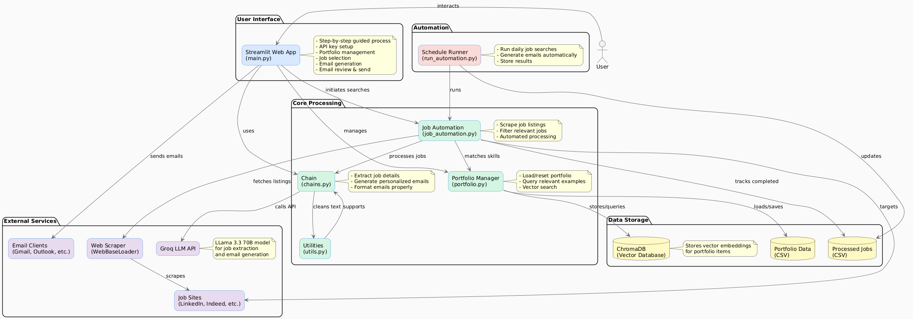
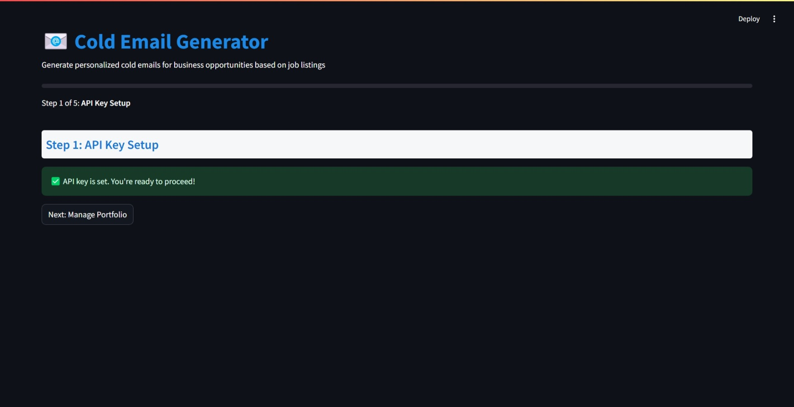
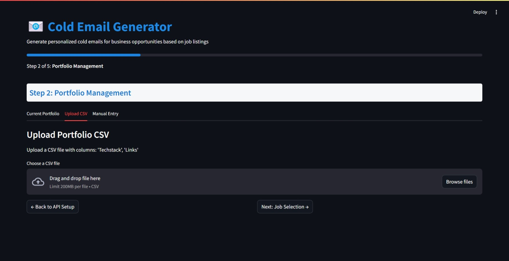
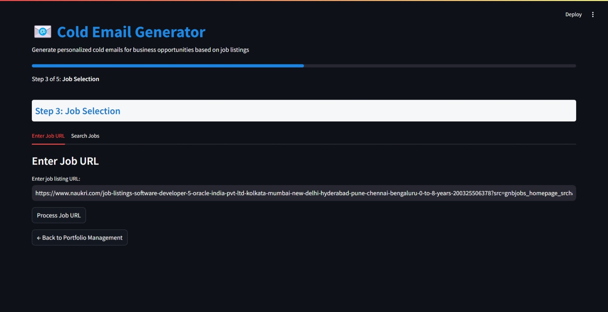
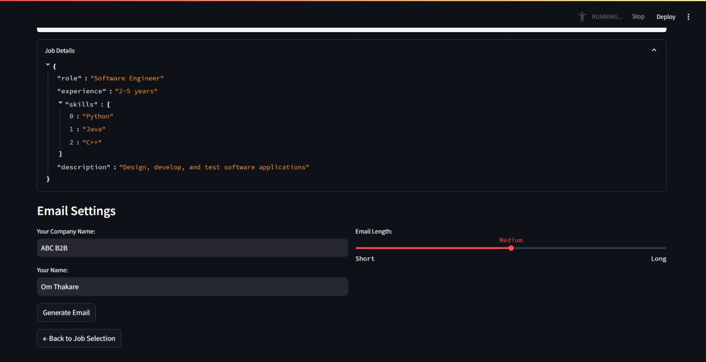
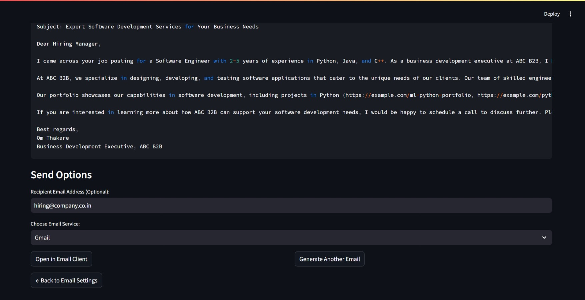
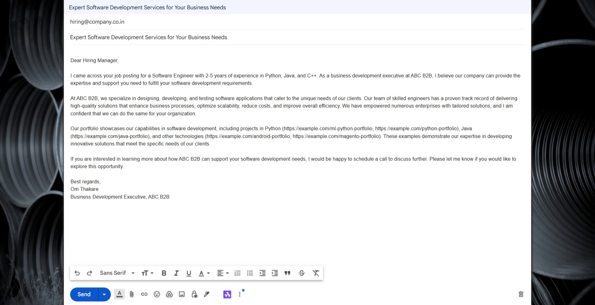

# 🥶📭 Cold Email Generator

An AI-powered cold email generator for service companies that automates business development outreach. Built with GROQ, LangChain, and Streamlit to help sales teams create personalized cold emails by analyzing job listings and matching them with relevant portfolio items.

## Overview

This application streamlines the business development process by:

- Scraping job listings from multiple websites
- Extracting key requirements and skills using AI
- Generating tailored cold emails that highlight relevant portfolio items
- Automating the entire process through scheduling

**Business Case:**
When companies like Netflix post job openings for positions like "Software Engineer," your software development company can use this tool to create personalized outreach emails. Instead of hiring full-time employees, you can offer your services as a more flexible alternative.

## Architecture Diagram



## Features

### 1. API Key Configuration

Configure your GROQ API key to power the AI text generation capabilities.



### 2. Portfolio Management

Upload your company's portfolio items with associated technologies through CSV or manual entry. The system uses vector search to match these with job requirements.



### 3. Job Selection & Processing

Enter specific job URLs or search across multiple job sites based on keywords.



### 4. AI-Powered Job Analysis

Extract job details, skills, and requirements automatically using large language models.



### 5. Personalized Email Generation

Generate tailored cold emails that match your portfolio strengths with the job requirements.



### 6. Email Client Integration

Open generated emails directly in your preferred email client (Gmail, Outlook, etc.).



### 7. Automated Job Processing

Schedule automated job searches and email generation for specific days and times.

## Installation

1. Clone the repository:

   ```commandline
   gh repo clone thakare-om03/gen-ai-project
   ```

2. Create a virtual environment:
   ```commanline
   python -m venv .venv
   ```
3. Install the dependencies:

   ```commandline
   pip install -r requirements.txt
   ```
4. Set up your GROQ API key:
   ```commandline
   Create a `.env` file in the `app` directory
   Add your API key: `GROQ_API_KEY=your-api-key-here`
   Get your API key from: https://console.groq.com/keys
   ```

5. Prepare your portfolio:
   ```commandline
   Edit `my_portfolio.csv` directly, or
   Use the application's portfolio management interface
   ```

## Usage

### Web Interface

   Run the Streamlit app:

   ```commandline
   streamlit run app/main.py
   ```

   Follow the step-by-step process:
   1. Configure your API key
   2. Manage your portfolio of services/projects
   3. Select job listings to analyze
   4. Generate customized cold emails
   5. Send emails through your preferred client